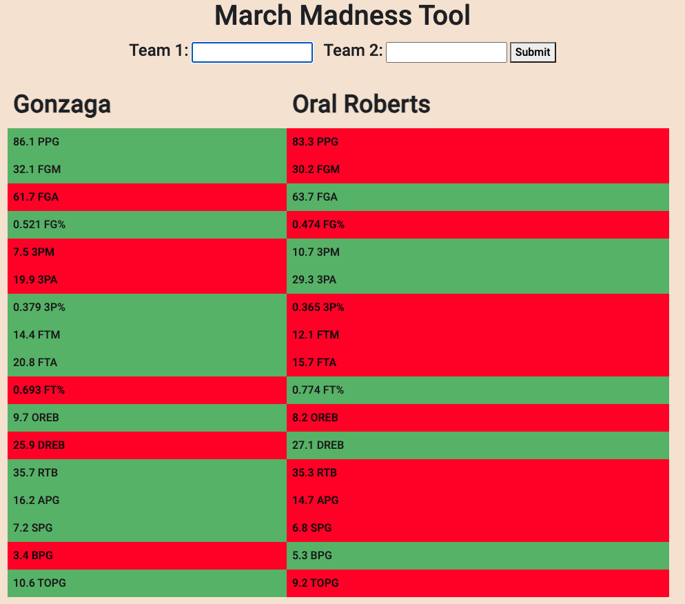
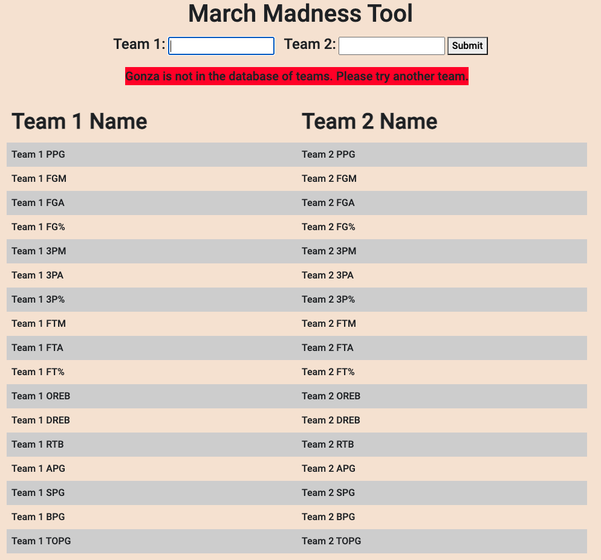
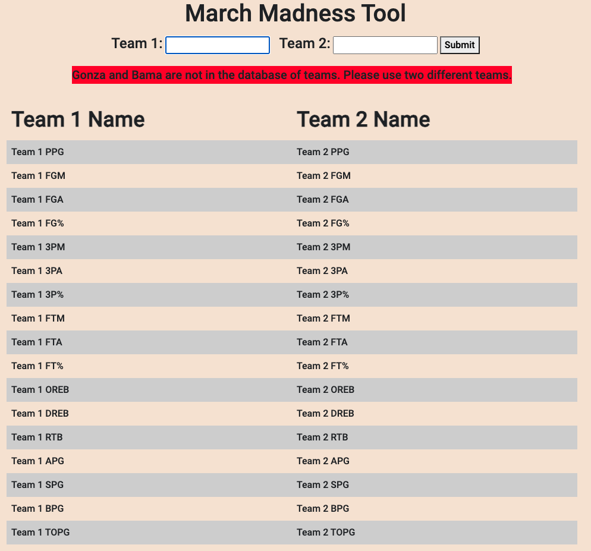

# March Madness Tool

# Description of Project
This is an application that people can use to fetch information about NCAA Men's DI Basketball Teams. It is very simple to use (type the names of both teams that you want to compare stats for) and also is more descriptive than other websites, as it lists out every stat rather than than a very small amount (which may not be enough for some people to make a decision in March Madness).  
To create this app, I used an [API that I made](https://github.com/christian7974/College-Basketball-API) to fetch the stats for the teams. I also used ejs to template the page to reduce the amount of repeated code and to overall make the program very readable. I also used Express and Node.js.

# Challenges I Faced
One challenge I faced at the beginning of the project was how to reduce the amount of repeated code when creating the table of statistics. At first, I had a lot of if-else statements which would be very hard to debug, as there would have to be one for every statistic. I created an array for both stats and looped through that array and compared the values in the loop. The final product looked something like this:
```javascript
<% for (var i = 0; i < team1Stats.length; i ++) { %>
                <tr>
                    <td class="<%= team1Stats[i] > team2Stats[i] ? 'greater-value' : 'lesser-value'%>"><%= team1Stats[i] %> <%= statEndings[i] %></td>
                    <td class="<%= team1Stats[i] < team2Stats[i] ? 'greater-value' : 'lesser-value'%>"><%= team2Stats[i] %> <%= statEndings[i] %></td>
                </tr>
            <% } %>
```
I also used ternary operators since that is an easier way of writing an if-else statement.

# Inspiration
I made this tool so that I could have a tool that could help me find the stats of teams and to be able to compare their stats to help me make a bracket for March Madness. The current tools that I was using (ESPN and other websites) either listed very few stats for each team or were behind a pay wall. I made this app so that people could find the statistics for free in an easy to use and friendly format. 

# Features/Functionality
To compare the stats of two teams, just type in both team names and the app will display the stats of both teams and color code the larger of the two stats.   

For instance, if you want to check the stats of Gonzaga and Oral Roberts, type them into the search boxes and you will see the following output:  




If you try to search for a team that is not in the API, you will get the following error:



And if you try to search for two teams that are not in the API (i.e if you mispelled a team name), you will get this error:  



The error messages come from the API as a JSON object and the website writes the value of the "error" key in that JSON object.

# Features To Be Implemented
- Compare multiple teams and have all of them shown in the webpage
- Make the website styled better (the purpose of this website was not to make the most visually pleasing)
- Functionality to log in and to save your previous searches

# Problem?
If you notice a problem with the results of the webpage (wrong statistics, a stat is colored red when it should be green, etc.) then please create an issue with a description of the problem and how you produced that problem. An issue would also include:
- The teams that you tried to search for
- An image of what the website produced  

Any more information would be very helpful in solving the problem.

